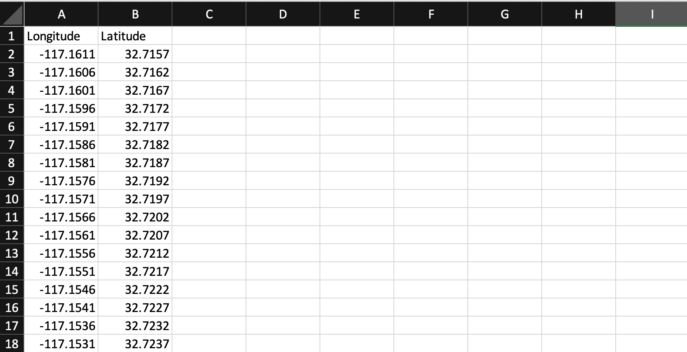
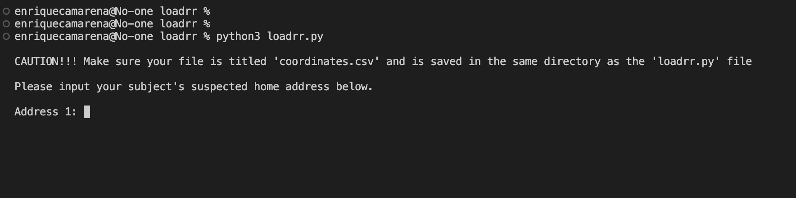

One of the biggest frustrations I had in my past life with a certain counter-narcotics agency was the fact that you were expected to retrieve enormous amounts of data and synthesize it in a timely manner with the commercial tools available. There were many inefficiencies that I vowed to change once I had the means and the freedom to. I deployed in a military capacity and earned some free time to develop this program to solve one unique problem I faced during my tenure at that agency. It all originated with cell phone pings... here's the picture: the good guys would build enough probable cause to get a court order signed to serve to a cellphone provider for subject cell phone pings both current and historical.

The good guys would then receive a report from said cellphone provider and would almost always include hundreds of coordinates in latitude and longitude. The issue was, the good guys did not have the means to rapidly develop a common operating picture, some agencies had fancy tools and software that did a decent job - but they came at a cost or a work-around. These fancy tools were always centralized to one provider and would often not function as intended due to the high amounts of application usage across a multi-agency task force/ hundred user agency.

If there's one thing I know for a fact, it's that most folks in law enforcement want nitty gritty factual data points to accurately depict their subject(s) and/or their investigation. 'Loadrr' was developed in this manner: simple, no smoke and mirrors, and minimal technical expertise required. I promise you won't have to endure a 2 day/8hr class on how to use this tool.

So step one. You receive cellphone pings back from a cellphone provider. Check. I've seen various formats and file types for court order returns, at minimum a cellphone provider will give latitude and longitude coordinates. I am currently working on a method to scan coordinates in a given file type and return the coordinates in a double column csv file. For now unfortunately this is where we have to be hasty and dependent on the type of data we need to see first.

Traditionally cell phone pings will give a pattern of life of your given subject(s). You can begin to associate addresses, geographical ares, and suspected addresses in order to continue developing your subject(s) more intimately. Copy, paste, and format your coordinates as follows:

I included mock longitude and latitude coordinates for educational purposes. Create a folder on your desktop with your newly created csv file inside. This part of the material is where we confirm or deny if your agency will allow scripts to run locally... generally speaking - most agencies do *not* allow scripts to be run locally. If this is the case for you, please email me and I will give you cloud access to this program (more on why that's not a standard late). If your agency is cool with you running scripts, buy your IT guy some coffee.

Okay, we have our cellphone pings in a csv file, we are ready to launch the program. Open up a command prompt, and chmod the script to allow execution. This would look like something like chmod 777 or 770; loadrr.py or icacls loadrr.py /grant Users:YOURUSERNAME, now this program relies on libraries only bundled with python version 3, so ensure you have python version 3 installed - cmd: python --version ... now that we verified our version of python we are ready to launch (very robust, I know) program. cmd: python3 loadrr.py, here's what you'll be greeted with:

Remember the data points statement? Well here is where we can develop our common operation picture by inputting an extra known data point (such as a subject's home address, supplier addres, etc.) outside of our cellphone pings. Sort of heat mapping, sort of pattern of life-ing, sort of just trying to make something out of nothing... government work, I know.

When we give our subject's address, the program is developed in a way that it converts the address to a lat/long coordinate and plots in on our newly created KML file. This KML file is automatically saved in our directory with the .csv and .py file. From this point we have a 2D common operating picture to brief. But that's no fun!

Load up google earth (preferably in an incongnito firefox browser) and open a new project > import KML file from computer > snip the page > VOILA! 

You now have a hasty method of presenting pattern of life analysis, association matrices, and a decent-brief-able subject timeline. I hope this is somewhat useful to basic investigative work. This project is ongoing. I would love to hear your opinons: mysteriouslytrue@cybersaloon.io, also here is where you can find the actual repo: https://github.com/digital-values/loadrr 

This is the end of my presentation, thank you for reading